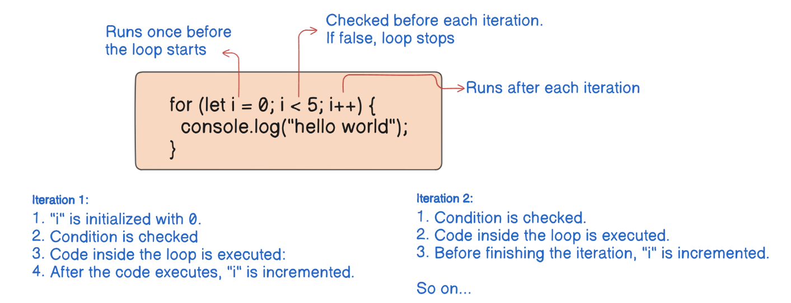

If you want to Learn Any Programming Language you need to know very well two things

1. Data Type
2. Processing

<details>
<summary>💡Tips: Repetition is necessary while learning Coding</summary>
<ul>Instead of going in-depth in various topics, you should practice it more often!</ul>
</details>

<details>
<summary>💬Important Resources</summary>
<ul>
  <li><a href="https://github.com/denysdovhan/wtfjs?tab=readme-ov-file#parseint-is-a-bad-guy">Javascript Quirks</a></li>
  <li><a href="https://javascript.info/">Javascript Tutorial</a></li>
  <li><a href="https://github.com/getify/You-Dont-Know-JS">You Don’t Know JS (2nd Edition, free & open)</a></li>
  <li><a href="https://www.youtube.com/watch?v=cCOL7MC4Pl0">Event Loop visual understanding</a></li>
</ul>
</details>

## **Introduction to JavaScript**
Foundations of programming logic, problem-solving, language concepts, and best practices.

- Developed by **Brendan Eich** in 1995.
- JavaScript is a **loosely** typed, **synchronous**, **single-threaded** language.

<aside>

> In dynamically-typed languages, types are determined at runtime.

> Loosely-typed languages doesn’t strictly enforce type rules. You can mix different types in operations, and the language itself tries to convert them automatically.

<details>
<summary>Code Example</summary>

```js
let num = 10;     // num is a number
num = "Hello";   // now num is a string (no error!)

console.log(5 + "5");  // Output: "55" (number + string = string)
console.log("5" - 2);  // Output: 3 (string converted to number)
```
</details>

## **Variable Declarations**

`var`, `let`, and `const` are the three ways to declare variables.

| **Keyword** | **Can Be Reassigned?** | **Can Be Redeclared?** | **TDZ?** | **Hoisted?** |
| --- | --- | --- | --- | --- |
| `var` | Yes | Yes | No | Yes |
| `let` | Yes | No | Yes | Yes |
| `const` | No | No | Yes | Yes |


>💡 **`const`** only prevents the reassignment of the variable, it doesn’t make the variable immutable. Objects declared with **`const`** can still be mutated.

> You should understand `const` declarations as "create a variable whose *identity* remains constant", not "whose *value* remains constant" — or, "create immutable [bindings](https://developer.mozilla.org/en-US/docs/Glossary/Binding)", not "immutable values".

## **Data Types in JavaScript**

### **Primitive Types**

- `string`
- `number` → Represents both integer and floating-point numbers, integers are limited by ±(253-1)
- `boolean`
- `null` → Represents absence/empty ness of value.
- `undefined` → Represents a declared variable without an assigned value.
- `symbol` → Unique, immutable value (often used for object keys).
- `bigint` → Represents arbitrary large integers (e.g., `123n`).

### **Reference Types**

- `object` → Includes Objects, Arrays, Functions, Dates, RegExp, etc.

**Operation** → [JS Comparison Table](https://dorey.github.io/JavaScript-Equality-Table/)

## **More About Primitives and Reference Types**

### 1. **Primitives** (Immutable & Passed by Value)
- Primitives are immutable, meaning their value cannot be changed once assigned.

  <details>
  <summary>Code Example</summary>

  ```js
  let user = "Jhon";
  user[0] = "Z"; // can’t modify the existing value
  console.log(user); // Output: "Jhon" (strings are immutable)

  // But can reassign a new value to the variable
  user = "Eve"
  console.log(user); // Output : "Eve"
  ```
  </details>

- When passed to a function or assigned to another a new variable, a copy is created, and each variable holds its own independent value.

  <details>
  <summary>Code Example</summary>

  ```js
  let user = "Jhon";
  let newUser = user; // newUser is a copy of user
  console.log({user, newUser});

  // But can reassign a new value to the variable
  user = "Eve"
  console.log(user); // Output : "Eve"
  ```
  </details>

- Primitives are compared by value, they are considered equal if they have the same content

  <details>
  <summary>Code Example</summary>

  ```js
  let a = "xyz";
  let b = "xyz";
  console.log(a === b); // Output: true (same value)
  ```
  </details>

### 2. **Reference Types** (Mutable & Passed by Reference)
- Reference types (objects, arrays, functions) are mutable, meaning their contents can be modified.

  <details>
  <summary>Code Example</summary>

  ```js
  let user = ['Ravi', 'Sonu']
  user[1] = 'Sunil'; // can modify the existing value
  console.log(user); // Output: ['Ravi', 'Sunil']
  ```
  </details>

- When passed to a function or assigned to another a new variable, both refers to the same memory location, meaning changes affect both.

  <details>
  <summary>Code Example</summary>

  ```js
  let user = { name: "Ravi" };
  let newuser = user; // Both user and newuser point to the same memory location

  console.log({user, newuser});

  newuser.text = "Raj"; // modifying newuser also affects both
  console.log(user.text); // Output: "Raj"
  console.log(newuser.text); // Output: "Raj"
  ```
  </details>

- Objects are compared by reference, they are considered equal only if they reference the same memory location.

  <details>
  <summary>Code Example</summary>

  ```js
  console.log({} === {}); // Output: always false (different references)
  ```
  </details>


## **Type Conversion**

Also known as **typecasting**, it means the **conversion** of a value from one data type to another.

### **Implicit Conversion (Type Coercion)**

- When JavaScript automatically converts one type to another.

- **Coercion Rules**
  - `+` operator → String concatenation if one operand is a string.
  - `-`, `*` ,`/` → tries to convert strings to numbers.
  - Booleans → `true` → `1`, `false` → `0`.

### **Explicit Conversion**

- When developer explicitly converts one type to another.

Mostly use `Number()`,`String()` & `Boolean()` to convert a value into number, string and boolean type respectively.

String to number 

- `parseInt()`
- `parseFloat()`

>💡**NaN (Not-a-Number)**  is a special value of the **`Number`,** represents an **invalid number**.

> When it occurs?
>  - Converting an **invalid string** **to a number**.
>  - Performing invalid mathematical operations.

>🤔 NaN is not equal to anything, even itself!  So how do check if something is NaN? 
👉 Using **`isNaN()`**

>💡JavaScript’s **loose equality (`==`)** performs type coercion, while **strict equality (`===`)** does not perform type coercion.

## **String Interpolation**

- Allows to embed variables (or any valid expressions) directly inside a string using **template literals** (``).

### `typeof` Operator

Returns a string indicating the **type** of a value.
    
>💡 `typeof null` returning "object" is a bug. It can’t be fixed, because that would break the existing legacy codebase. 

[Code examples covered so far](./js_topic/variable-datatype.js)

## **Conditional Statements**

Used to make decisions based on certain conditions.

| Concept | Description |
|---------|-------------|
| **If-else**| Used for general conditional branching |
| **Switch** | Used when checking **one fixed value** against multiple cases, uses **strict equality (`===`)** meaning types must match, **Cannot use relational operators** (`>`, `<`, etc.). |
| **Ternary Operator (`? :`)**  | A shorthand for simple conditional expressions |

[Code examples covered so far](./_control_flow/conditional.js)

## **Truthy** and **Falsy** Values

Determine how expressions evaluate in boolean contexts (like in  `if-else` statements).

### **Falsy Values**

There are exactly 8 **falsy values** in JavaScript

&nbsp; `false` &nbsp; `0` &nbsp; `-0` &nbsp; `0n` (BigInt zero) &nbsp; `""` (empty string) &nbsp; `null` &nbsp; `undefined` &nbsp; `NaN` &nbsp;

### **Truthy Values**

Everything else is **truthy**, including:

- All objects (including empty objects `{}` and arrays `[]`)
- Non-empty strings: `"hello"`, `"0"`, `"false"`
- Non-zero numbers (including negative numbers and `Infinity`)
- Functions, Symbols, and BigInt.
- `new Boolean(false)` (it’s an object, not primitive `false` and objects are always truthy)

> [Learn more about the quirks of truthy and falsy values.](https://akgbytes.hashnode.dev/mastering-truthy-and-falsy-in-js-no-more-confusion)

### **Logical Operators**

- `&&` returns the first falsy value.
- `||` returns the first truthy value.
- `??` returns the first defined value
- `!` negates the boolean value.
- `!!` converts a value to its boolean equivalent.


## **Loops in JavaScript**

Loops allow you to execute a block of code **multiple times** based on a condition.

### **For Loop**

- Used when the **number of iterations is known**.
- Consists of 3 parts ⇒ I**nitialization, Condition, Updation**.



### **While Loop**

- Used when **the number of iterations is unknown** and depends on a condition.
- The condition is checked **before** executing the loop body.

### **Do-While Loop**

- Similar to `while`, but **executes at least once**, even if the condition is `false`.
- The condition is checked **after** the loop body executes.

### **for...of Loop**

- Used to iterates over **values** of an iterable (like array, string).

### **for...in Loop**

- Used for iterating over object properties but should be used carefully, as it iterates over inherited properties as well.
- It iterates over the **keys** of an object or indices of an array.

## **Break and Continue Statements**

| **Break Statement** | **Continue Statement** |
|---------------------|-----------------------|
| **Exits** the loop immediately when a condition is met. | **Skips** the current iteration and moves to the next one. |

[Code examples covered so far](./_loops_control_flow/iterator.js)

## **Functions in JavaScript**

- Functions `factory do something (only one work)` are reusable piece of code designed to perform a particular task.

### **Function Statement (Function Declaration)**
- Simple fn → Hoisted, means can be accessed before declaration.

### **Function Expression**

- Functions that are assigned to a variable.
- Not hoisted means they can’t be accessed before declaration.

### **Anonymous Function**

- Functions without name, they are usually used as values in function expressions or used as callbacks.

### **Arrow Functions**

- More concise syntax for writing functions.
- Inherit `this`  from their parent scope.
- Don’t have their own `arguments` object, they rely on `arguments` from the surrounding scope.

### **IIFE (Immediately Invoked Function Expressions)**

- Functions that executes right after it is defined.
- IIFE helps avoid polluting the global scope by keeping variables inside it private.

### **Higher-Order Function**

A function that takes another function as an argument or returns a function.

### **Callback Function**

Function that is passed as an argument to another function.

### **`arguments` Object in Functions**

- Array-like object accessible inside regular functions.
- Contains all the arguments passed to the function.
- Useful when you want to handle unknown number of arguments.

> **`arguments`** object is called **"array-like"** because it behaves similarly to an array in some ways (like having indexed access and a `length` property).

> However, it is **not an array** because it doesn’t have array methods, and it is not an instance of the `Array` constructor.

> [Function: length - JavaScript | MDN](https://developer.mozilla.org/en-US/docs/Web/JavaScript/Reference/Global_Objects/Function/length)


## **Memory Allocation in JavaScript**

### **Stack Memory Allocation**

- Stores **primitive data types** (`Number`, `String`, `Boolean`, `null`, `undefined`, `Symbol`, `BigInt`).
- Stores **function calls and execution contexts**.
- Works with **pass-by-value** (values are copied, not referenced).
- Automatically freed when the function execution completes.

  <details>
  <summary>Code Examples</summary>

  ```js
  let num1 = 10; // Stored in stack
  let num2 = num1; // A copy of num1 is created in stack
  num2 = 20; // num1 remains unchanged
  ```
  </details>

### **Heap Memory Allocation**

- Stores **non-primitive types** (`Objects`, `Arrays`, `Functions`).
- A **reference** to the object is stored in the stack, while the actual object is in the heap.
- Objects are **mutated via reference** (not copied).

  <details>
  <summary>Code Examples</summary>

  ```js
  let obj1 = { name: "Armin" }; // Allocated in heap
  let obj2 = obj1; // obj2 stores a reference, not a copy
  obj2.name = "Annie"; 

  console.log(obj1.name); // "Annie" (same object modified)
  ```
  </details>

- If a function retains access to variables after execution, those variables persist in the heap.

  <details>
  <summary>Code Examples</summary>

  ```js
  function counter() {
    let count = 0; // Stored in heap because of closure
    let greet = "Welcome"; // Not used in increment fn so it will be stored in stack
    console.log(greet);

    return function increment() {
      count++;
      console.log(count);
    };
  }

  const inc = counter(); // Closure is formed, `count` persists in heap
  inc(); // 1
  inc(); // 2
  ```
  </details>

## **Garbage Collection (GC) in JavaScript**

JavaScript uses **Automatic Garbage Collection** to free up heap memory when objects are no longer needed.

### **Mark & Sweep Algorithm**

1. **Mark Phase**: The GC identifies which objects are still **reachable** (accessible from the root like `window`, global scope, or active function stack).
2. **Sweep Phase**: The GC **removes** objects that are **unreachable** (no references pointing to them).

JavaScript **does not immediately** free memory when an object is unused—GC runs **periodically**.

```js
function createUser() {
    let user = { name: "Armin" }; // Allocated in heap
    return user;
}
let ref = createUser(); // `ref` holds the reference
ref = null; // Now, the object is unreachable and can be garbage collected
```

When `ref = null`, the object `{ name: "Armin" }` is **no longer reachable**, so the garbage collector will clean it up in the next GC cycle.

## **Scope**

It basically means where we can access a specific variable or function.

### **Global Scope**

Variables declared outside of any function or block belong to the global scope and are accessible from anywhere.

### **Function scope**

- Variables declared within a function cannot be accessed from outside.
- `var` is globally scoped or function-scoped.

  <details>
  <summary>Code Example</summary>
      
  ```js
    if (true) {
      var user = "armin";
    }
    console.log(user); // can access because it is not block-scoped
    
    function someFn() {
      var city = "jaipur";
    }
    
    console.log(city); // ReferenceError, because var is function-scoped
  ```
  </details>
    

### **Block Scope**

- Variables declared inside a block (within `{}`), such as in loops or conditional statements, are scoped to that block.
- `let` or `const` are block-scoped.
  <details>
  <summary>Code Example</summary>
    
  ```js
    if (true) {
      let user = "armin";
    }
    console.log(user); // error, can't access because let is block-scoped
  ```
  </details>
    
- Variables declared within a function cannot be accessed from outside.
- `var` is globally scoped or function-scoped.

  <details>
  <summary>Code Example</summary>
      
  ```js
    if (true) {
      var user = "Ravi";
    }
    console.log(user); // can access because it is not block-scoped
    
    function someFn() {
      var city = "sonipat";
    }
    
    console.log(city); // ReferenceError, because var is function-scoped
  ```
  </details>

### **Lexical Scope**

- Means that the location where a variable or function is defined **determines its scope**.
- When trying to access a variable, JavaScript will first look in the current scope. If it's not found, it will move outward to the next outer scope, continuing until it either finds the variable or reaches the global scope. This is called **Scope Chaining**.

```js
  const user = "armin";
  const city = "jaipur";
  
  function outerFn() {
    const city = "delhi";
    function innerFn() {
      const pincode = 311001;
      console.log(pincode);
      // first searches for "user" and "city" in local scope, then in parent scope,
      // then in parent's parent scope until it reaches global scope
      console.log(user);
      console.log(city);
    }
    innerFn();
  }
  outerFn();
```
    
## **Hoisting**

- Hoisting is a JavaScript behavior where variable and function declarations are moved to the top of their current scope during the compilation phase.
- Means we can use functions and variables before their declarations.

>💡Hoisting helps to write cleaner code but also produces unexpected behavior in case of `var`

## **TDZ** (**Temporal Dead Zone)**

Refers to the period between when a variable is **declared** using `let` or `const`, and when it is **initialized** with a value. During this phase, the variable exists but cannot be accessed, resulting in a `ReferenceError` if you try to use it before its initialization.

| Feature | `var` | `let` & `const` |
| --- | --- | --- |
| **Scope** | Function-scoped | Block-scoped |
| **Hoisting** | Hoisted with `undefined` | Hoisted but not initialized (Temporal Dead Zone) |
| **Global Object** | Becomes `window` property in case of Browsers but not in case of Node JS. | Does NOT become **global** property. |

> To make a variable truly **global** in Node.js, you need to attach it to `global`
  ```js
    global.user = "ravi";
    console.log(globalThis.user);
  ```

## **Shadowing**

- Occurs when a inner variable **overrides (shadows)** the outer one within its scope. 
```js
  let user = "armin"; // Global scope
  
  function something() {
    let user = "annie"; // Shadows global 'user'
    console.log(user); // "annie" (uses local 'user')
  }
  something();
```

## **Global Execution Context**

When JavaScript runs your code, it **creates a Global Execution Context, t**hink of it as a "container" that holds and manages the code being executed.

The GEC has two key phases:

- Memory Phase
    - The JS engine scans through the code and allocates memory for all variables and functions.
    - Variables are initialized with `undefined`, while function declarations are stored in memory with their complete definitions.
- Execution Phase
    - Whole code is executed line by line
    
> [JavaScript Visualizer](https://ui.dev/javascript-visualizer)
    
```js
  var num1 = 20
  var num2 = 20
  
  function addNums(num1,num2){
      var sum = num1 + num2
      return sum
  }
  
  var result = addNums(num1,num2)
  
  console.log(result);
```
    
1. Node js creates a global execution context when you run your code.
    
  
    

1. Whole code is traversed, all variables are initialized with `undefined` and functions with their actual definitions in MEMORY PHASE
    
  
    

1. In EXECUTION PHASE, code is executed line by line and variables get initialized with their actual values.
    
  
    

1. When a function is invoked, a **Function Execution Context** is created. This has its own MEMORY and EXECUTION phase, similar to the global context.
The function parameters are **immediately assigned values**.
    
  
    

1. Executes the local code
    
  
    

1. Once the function finishes executing, its **Function Execution Context** is popped off the **Call Stack** and terminated.

  
    
    
>💡The **Call Stack** keeps track of the execution contexts. Each time a function is called, its context is pushed onto the stack, and when the function returns, its context is popped off.  

## **Closures**

- A **closure** is a function that retains access to its lexical scope, even after the outer function has executed.
- Closures are formed when an inner function references variables from its outer function.
- Because closures keep **references to outer variables**, they can sometimes prevent memory from being released when those variables are no longer needed.

    
> Closures allow us to create **private variables** that cannot be accessed from outside.
    
```js
function createCounter() {
  let count = 0; // This variable is "private"

  return {
    increment: function () {
      count++; // Closure formed, `count` persists and stored in heap
      return count;
    },
    decrement: function () {
      count--;
      return count;
    },
    getCount: function () {
      return count;
    },
  };
}

const counter = createCounter();
console.log(counter.increment()); // 1
console.log(counter.increment()); // 2
console.log(counter.decrement()); // 1
console.log(counter.getCount()); // 1
console.log(counter.count); // undefined (count is private)
```

## **Partial Application**

**Partial Application** is a technique where you create a new function by fixing some of the arguments of an existing function, leaving the rest to be filled later.


    
```js
  function partialFn(fn, ...fixedArgs) {
    return (...remainingArgs) => fn(...fixedArgs, ...remainingArgs);
  }
  
  let multiplyBy5 = partialFn(multiply, 5);
  console.log(multiplyBy5(4));
  
  // another way of achieving same
  const multiplyBy2 = multiply.bind(null, 2);
  console.log(multiplyBy2(7));
  
  function multiply(a, b) {
    return a * b;
  }
``` 

## **Currying**

**Currying** is a technique in which a function with multiple arguments is transformed into a sequence of functions, each taking a single argument.
 
```js
  function curry(fn) {
    return function curried(...args) {
      if (args.length >= fn.length) {
        return fn(...args);
      } else {
        return (...nextArgs) => curried(...args, ...nextArgs);
      }
    };
  }

  const add = (a, b, c) => a + b + c;

  const curriedAdd = curry(add);

  console.log(curriedAdd(1)(2)(3)); // 6
  console.log(curriedAdd(1, 2)(3)); // 6
  console.log(curriedAdd(1, 2, 3)); // 6
```   

## **Once Function**

The **"once"** pattern ensures that a function can only be executed a single time. After being called once, the function is prevented from running again.

```js
  function once(fn) {
    let executed = false;
    return (...args) => {
      if (!executed) {
        executed = true;
        return fn(...args);
      }
    };
  }
  
  const greet = (user) => console.log(`Hello there ${user}`);
  const greetOnce = once(greet);
  
  greetOnce("Armin"); // Hello there Armin
  greetOnce("Annie"); // (Nothing happens)
```  

## **Memoization**

**Memoization** is a technique for optimizing function performance by caching results of expensive function calls. When the same inputs are provided again, the function retrieves the result from the cache instead of recomputing it.

## **Function Composition**

**Function Composition** is a method of combining multiple functions to perform complex operations in a cleaner, modular way.

---

## **`this` keyword**

The `this` keyword refers to the current context and its value depends on **where and how** a function is called.

1. **Global Context** 
  
  - In **browsers**, `this` refers to the **global object** (`window`)
        
    ```js
    console.log(this === window); // true
    ```
        
  - In **Node.js**, `this` in the global scope **does not** refer to `global`.
        
    **Each file in Node.js is treated as a separate module and is wrapped in a function during execution**. Because of this, `this` inside a module **initially** refers to `module.exports` (which is `{}` by default)
        
    ```js
      console.log(this); // {}
      console.log(this === module.exports); // true
      console.log(this === global); // false
      
      // --------------------------------------------------------------------
      
      function greet() {
        console.log(this);
      }
      
      function sayHello() {
        console.log(this);
      }
      
      module.exports = {
        greet,
        sayHello,
      };
      
      // false, because we reassign module.exports to an
      // entirely new object { greet, sayHello } and this is still pointing to {}
      console.log(this === module.exports);
      
      // --------------------------------------------------------------------
      
      // module.exports.greet = function greet() {
      //   console.log(this);
      // };
      
      // module.exports.sayHello = function sayHello() {
      //   console.log(this);
      // };
      
      // // true, because this time we didn't reassigned
      // // module.exports a completely new object
      // console.log(this === module.exports);
    ```
        

1. **Object Method Context**
  - Inside an object, `this` refers to the object itself.

    ```js
      const obj = {
        name: "Armin",
        greet() {
          console.log(`Welcome ${this.name}!`);
        },
      };
      obj.greet();
    ```
        

1. **Constructor Function Context**
  - Inside a constructor function, `this` refers to the new instance being created.

    ```js
      function Student(name) {
        this.name = name;
      }
      const s1 = new Student("Armin");
      console.log(s1.name);
    ```
        

1. **Arrow Function Context**
  - Arrow functions do not have their own `this` binding. Instead, they inherit `this` from the surrounding lexical context.

    ```js
      const obj = {
        name: "Armin",
        greet: () => {
          console.log(`Welcome ${this.name}!`); // undefined
        },
      };
      obj.greet();
    ```
        

1. **Function Context**
  - **Non-strict mode**
    - `this` refers to the **global object** (`window` in browsers, `global` in Node.js).
  - **Strict mode**
    - `this` is `undefined`.

> In non-strict mode, a special process called **this substitution** ensures that the value of `this` is always an object. It means:

- If a function is called with `this` set to `undefined` or `null`, `this` gets substituted with [`globalThis`](https://developer.mozilla.org/en-US/docs/Web/JavaScript/Reference/Global_Objects/globalThis).
- If the function is called with `this` set to a primitive value, `this` gets substituted with the primitive value's wrapper object.

    
```js
  function getThis() {
    // in non-strict mode, it gives primitive wrapper object
    // "use strict"; // in strict mode it gives literal value
    console.log(this);
  }
  
  function greet() {}
  
  getThis.call(Symbol(5));
```

### **`call()`**

- It **immediately** invokes the function with a given `this` value and arguments passed individually.
    
```js
  function greet(age, city) {
    console.log(`${this.name} is ${age} years old and lives in ${city}.`);
  }
  
  const person = { name: "Armin" };
  greet.call(person, 21, "jaipur");
```
    

### **`apply()`**

- Same as `call()` but takes **arguments as an array**.
    
```js
  function greet(age, city) {
    console.log(`${this.name} is ${age} years old and lives in ${city}.`);
  }
  
  const person = { name: "Armin" };
  greet.apply(person, [21, "jaipur"]);
```
    

### **`bind()`**

- `bind()` returns a **new function** with the specified `this` context.
  
```js
  function greet(age, city) {
    console.log(`${this.name} is ${age} years old and lives in ${city}.`);
  }
  
  const person = { name: "Armin" };
  const greetMe = greet.bind(person, 21, "jaipur");
  greetMe();
```

## **Prototypes**

- A **prototype** is an object from which other objects inherit properties and methods, forming a chain of inheritance called **prototype chain.**
- When accessing a property or method on an object:
    - JavaScript first **checks if the property exists on the object itself**.
    - If not found, it **looks up the prototype chain** until it finds it (or reaches `null`).

| Term | Meaning |
| --- | --- |
| **Prototype** | The object that another object inherits from. |
| **`__proto__`** | A property on an **instance** that points to its prototype. |
| **`prototype`** | A property on a **constructor function** that determines the prototype of its instances.|

### **`Object.prototype` and the Root of Inheritance**

- Every object (except those created with `Object.create(null)`) **inherits from `Object.prototype.`**
- That’s why, it is called that almost everything in **JavaScript** is an object.


### **`Object.create()`**

- It allows creating an object **with a specific prototype**, providing more control over prototype inheritance.

```js
  const parent = {};
  const child = Object.create(parent);
  
  console.log(child.__proto__ === parent); // true
```

## **Function Constructors**

- A **constructor function** is a special function used to create objects with shared properties and methods.
    
```js
  function Person(name, age) {
    this.name = name;
    this.age = age;
  }
  
  Person.prototype.greet = function () {
    return `Hello, My name is ${this.name}`;
  };
  
  const user = new Person("Armin", 21);
  console.log(user.greet());
```
    
1. **What Does `new` Do?**
  - Creates a new empty object
  - Links the object's `__proto__` to the constructor function's `prototype`
  - Binds `this` to the new object inside the function.
  - Returns the new object, unless another object is explicitly returned.

  ```js
    console.log(user.__proto__ === Person.prototype); // true
  ```
        
2. **Creating private variables**
        
  ```js
    function Person(name, age) {
      let secret = "xyz";
      this.name = name;
      this.age = age;
    
      this.getSecretKey = function () {
        console.log(secret);
      };
    }
    
    Person.prototype.greet = function () {
      return `Hello, My name is ${this.name}`;
    };
    
    const user = new Person("Armin", 21);
    console.log(user.greet());
    console.log(user.secret)  // undefined, can't access private variables
    user.getSecretKey();
  ```
        
3. **Can a constructor function return something other than `this` (the newly created object)?**
    - If you explicitly returns an object, `this` is ignored and the returned object is used instead.
    - If a **non-object** (like `null`, `undefined`, number, string, boolean) is returned, JavaScript **ignores it** and still returns `this`.
     
    ```js
      function Person(name, age) {
        this.name = name;
        this.age = age;
      
        return {
          city: "Jaipur",
        };
      }
      
      const user = new Person("Armin", 21);
      console.log(user);
    ```
        
4. **Arrow functions do not have their own `this`, so they cannot be used as constructor functions.**

```js
  const Person = (name, age) => {
    this.name = name;
    this.age = age;
  };
  
  const user = new Person("Armin", 21); // TypeError: Person is not a constructor
```
    
1. **Detecting Constructor Calls with `new.target`**
  - A function can determine if it was called with `new` using `new.target`.
  - `new.target` is only `undefined` when the function is invoked without `new` .

  ```js
    function Person(name, age) {
      if (!new.target) {
        return `Called without new`;
      }
      this.name = name;
      this.age = age;
    }
    
    const user = new Person("Armin", 21);
    const user2 = Person();
    console.log(user);
    console.log(user2); // Called without new
  ```

## **Object-Oriented Programming (OOPS)**

JavaScript introduced the `class` syntax in **ES6** as a cleaner way to work with **constructor functions and prototypes**. But under the hood `class` is just a syntactic sugar over JavaScript’s prototype-based inheritance.

### **Class and Objects**

- A `class` is simply a **blueprint** for creating objects.
- An object is simply an instance of an class.

```js
  class Person {
    constructor(name, age) {
      this.name = name;
      this.age = age;
    }
  
    greet() {
      console.log(`Hello, my name is ${this.name}`);
    }
  }
  
  // Creating an instance
  const user = new Person("Armin");
  user.greet();
```

### **`constructor`**

- A special function that runs automatically when a new instance of a class is created.
- It initializes the object with default or user-provided values.

### **Inheritance**

- Inheritance allows one class to inherit properties and methods from another.
- JavaScript supports inheritance via the `extends` keyword.

```js
  // Parent class (Base class)
  class Vehicle {
    constructor(brand, model, year) {
      this.brand = brand;
      this.model = model;
      this.year = year;
    }
  
    displayInfo() {
      console.log(`${this.year} ${this.brand} ${this.model}`);
    }
  }
  
  // Child class (Car)
  class Car extends Vehicle {
    constructor(brand, model, year, seats) {
      super(brand, model, year); // Call parent constructor
      this.seats = seats;
    }
  
    carDetails() {
      console.log(`Car: ${this.year} ${this.brand} ${this.model} with ${this.seats} seats.`);
    }
  }
  
  // Child class (Bike)
  class Bike extends Vehicle {
    constructor(brand, model, year, type) {
      super(brand, model, year);
      this.type = type; // e.g., "Electric", "Manual"
    }
  
    bikeDetails() {
      console.log(`Bike: ${this.year} ${this.brand} ${this.model} - ${this.type} type.`);
    }
  }
  
  // Creating instances
  const car1 = new Car("Toyota", "Corolla", 2023, 4);
  const bike1 = new Bike("Yamaha", "MT-15", 2022, "Manual");
  
  car1.carDetails(); // Output: Car: 2023 Toyota Corolla with 4 seats.
  bike1.bikeDetails(); // Output: Bike: 2022 Yamaha MT-15 - Manual type.
  
  car1.displayInfo(); // Output: 2023 Toyota Corolla
  bike1.displayInfo(); // Output: 2022 Yamaha MT-15
```

### **`super`**

It is used in **class inheritance** to refer to the parent class. It allows child classes to:

1. **Call the parent class constructor** (`super(...)`) to inherit properties.
2. **Access parent class methods** (`super.methodName(...)`) inside the child class.

```js
  class Parent {
    greet() {
      console.log("Hello from Parent");
    }
  }
  
  class Child extends Parent {
    greet() {
      super.greet(); // Calls Parent's greet()
      console.log("Hello from Child"); // Overriding the greet() method
    }
  }
  
  const obj = new Child();
  obj.greet();
```

### **Encapsulation**

- Encapsulation is the principle of bundling data and methods within an object.
- Hiding **data** by restricting direct access.
- Using **private fields (#), closures, or getters/setters.**
- Getters (`get`) and setters (`set`) allow controlled access to private fields while keeping the syntax **cleaner and more intuitive**.

    
```js
  class BankAccount {
    #balance = 0; // Private field (Encapsulated data)
  
    constructor(accountHolder) {
      this.accountHolder = accountHolder;
    }
  
    deposit(amount) {
      this.#balance += amount;
      console.log(`Deposited ${amount}. New balance: ${this.#balance}`);
    }
  
    // Providing controlled access
    get balance() {
      return this.#balance;
    }
  
    set balance(amount) {
      if (amount < 0) {
        console.log("Balance cannot be negative!");
      } else {
        this.#balance = amount;
      }
    }
  }
  
  const myAccount = new BankAccount("Armin");
  myAccount.deposit(100);
  myAccount.balance = -2000;
```
    

### **Abstraction**

- Abstraction involves hiding **implementation details** while showing only necessary parts.
    
```js
  class ATM {
    #balance = 1000; // Private field (Encapsulated)
  
    withdraw(amount) {
      // Abstracts away how balance is checked & updated
      if (this.#hasSufficientFunds(amount)) {
        this.#balance -= amount;
        console.log(`Withdrawn ${amount}. Remaining balance: ${this.#balance}`);
      } else {
        console.log("Insufficient funds.");
      }
    }
  
    #hasSufficientFunds(amount) {
      // Private method (Hidden logic)
      return amount <= this.#balance;
    }
  }
  
  const atm = new ATM();
  atm.withdraw(500);
```

**Encapsulation** as **hiding data**, and **Abstraction** as **hiding complexity**.

| Real-Life Analogy | Encapsulation  | Abstraction  |
| --- | --- | --- |
| **Car's Engine** | You **cannot directly modify** the engine internals | You just press the **start button** without worrying about the engine process |
| **ATM Machine** | You cannot see **how balance is stored internally** | You just use **`withdraw()`**, without worrying about validation logic |

### **Polymorphism**

- Polymorphism allows child classes to modify or extend the behavior of parent methods.

### **Method Overriding**

```js
  class Parent {
      greet() {
          console.log("Hello from Parent");
      }
  }
  
  class Child extends Parent {
      greet() {
          console.log("Hello from Child"); // Overriding parent method
      }
  }
  
  const obj = new Child();
  obj.greet(); // Hello from Child
```  

### **Method Overloading**

- JavaScript does not support method overloading natively, but it can be simulated.
  
```js
  class Calculator {
    add(a, b, c) {
      if (c !== undefined) return a + b + c;
      return a + b;
    }
  }
  
  const calc = new Calculator();
  console.log(calc.add(2, 3)); // 5
  console.log(calc.add(2, 3, 4)); // 9
```

### **`static`**

- Used to define methods and properties that **belong to the class itself**, rather than its instances.
    
```js
  class MathUtils {
    static square(num) {
      return num * num;
    }
    static PI = 3.14;
  }
  
  console.log(MathUtils.square(4)); // 16
  console.log(MathUtils.PI); // 16
  
  const math = new MathUtils();
  // console.log(math.square(4)); // TypeError: math.square is not a function
``` 

### **`instanceof`**

- Checks whether an object is an instance of a particular class.
- More specifically, it verifies if the **prototype chain** of an object includes the constructor’s prototype.
    
```js
  object instanceof Constructor;
```
    
- Works only for **objects**, not **primitive values**.

```js
  class Person {}
  const user = new Person();
  
  console.log(user instanceof Person); 
  console.log(user instanceof Object); 
```

### **Autoboxing** *(Temporary Wrapping)*

JavaScript **temporarily wraps** primitives in objects when accessing properties.

When you access `.length` or call a method on a primitive string, JavaScript **automatically wraps** it in a `String` object **just for that operation**:

```js
  console.log("abc".length); // 3 
  console.log("hello".toUpperCase()); // "HELLO" 
```

🤔 **What happens internally?**

- So when you do `console.log("abc".length)` , behind the scenes, JavaScript does this:
    
```js
  console.log(new String("abc").length);
```
    
- The primitive `"abc"` is **temporarily converted** into a `String` object.
- The property (`length`) is accessed.
- The temporary object **disappears immediately** after use.

📌 **Temporary Objects are Not Persistent**

```js
  const user = "armin";
  console.log(user);
  
  user.something = "hello"; // Trying to add a property
  console.log(user.something); // undefined (because the temporary object disappears)
  
  //
  const newUser = new String("annie");
  console.log(newUser);
  
  newUser.city = "jaipur";
  console.log(newUser.city); // accessible
```
    
### **Nullish Coalescing Operator (`??`)**

Useful for setting default values only when the left-hand value is `null` or `undefined`.

```js
  //assigns "Guest" only if userName is null or undefined
  const name = userName ?? "Guest"; 
```

### **Optional Chaining (`?.`)**

Enables safe navigation through nested properties without checking each level manually.
This will return `undefined` instead of throwing an error if `user` or `address` is missing.

```js
 const city = user?.address?.city;
```

## **JS facts**

1. **Before printing anything with `console.log()`**, JavaScript first processes the value based on its type.
  - **Primitives** (number, string, boolean, `null`, `undefined`) are converted using `String(value)`.
  - **Arrays** use `Array.prototype.toString()` but still appear structured.
  - **Objects** are **not** converted using `.toString()`. Instead, the console **inspects their properties** and formats them for readability.
  - **In Node.js**, this formatting is similar to `util.inspect()`.

**Before printing anything with `console.log()`**, JavaScript first converts it into string.

## **Understanding this keyword in js**

Whenever `this` is used, it refers to the context (`संदर्भ` ) in which a piece of code is executed.

> ***kab aur kaha function call hoga uspe this depend karega uska context kya hoga***

```js
const person = {
  name: "Ram",
  greet() {
    console.log(this.name); // here this has context of person obj in "***regular function***"
  }
};

person.greet(); // output will be Ram
```

## **How this behaves in global space (global scope) ?**

```js
  // what is global space ?
  console.log(this) 
  // here the console log this is in global space 
  function test(){
  console.log(this)
  }
  // and the console this inside function is in the funtional space
```

The value of `this` in the global scope is the global object, which depends on the runtime environment in which it is executed.

### **In Browsers**

The value of `this` in the global scope refers to the global object, which is `window` in browsers.

- **See here** 👇
    
  
    

### **But why ?**

JavaScript is used to add dynamicity to web pages, and with JavaScript, we can manipulate the DOM. The main global object that provides methods in the browser is `window`, so by default, everything in the global scope points to `window`. That’s why the execution context inside the browser is the `window` object

```js
// guess the output
console.log(this === window)
<button onclick="console.log(this.tagName)">Click me</button>
// Please try by yourself first !!!
```

## **In Nodejs**

The value of `this` in the global scope of Node.js doesn't refer to the global object. Node.js is based on a module system where different modules are created and isolated from each other. This means they can't share anything (variables) unless they explicitly do so by exporting from a particular module. 

In this context, `this` will depend on module exports, which by default is an empty object `{}`


### **Behind the scenes (require module)**

When you create a file in Node.js (jaise `index.js`), Node.js **automatically wraps** the entire file inside a special function. 

**You don't see this function in your code**, but it looks something like this:

```js
(function (exports, require, module, __filename, __dirname) {
    // Your module code is actually running inside this function!
});
```

```js
  console.log(this); 
  console.log(this === module.exports); 
  // Now guess the output
```
    
```js
  console.log(this); // {}
  console.log(this === module.exports); // true
  console.log(this === global); // false
  
  // --------------------------------------------------------------------
  
  function greet() {
    console.log(this);
  }
  
  function sayHello() {
    console.log(this);
  }
  
  module.exports = {
    greet,
    sayHello,
  };
  
  // false, because we reassign module.exports to an
  // entirely new object { greet, sayHello } and this is still pointing to {}
  console.log(this === module.exports);
  
  // --------------------------------------------------------------------
  
  // module.exports.greet = function greet() {
  //   console.log(this);
  // };
  
  // module.exports.sayHello = function sayHello() {
  //   console.log(this);
  // };
  
  // // true, because this time we didn't reassigned
  // // module.exports a completely new object
  // console.log(this === module.exports);
```

## **For (import / export)**

## **No Function Wrapping in ES Modules**

- Node.js **does not** wrap ES Modules in a function.
- Instead, **ES Modules are executed in strict mode by default** (`'use strict'` is **always enabled**).
- `this` in ES Modules **is `undefined`** at the top level (instead of an empty `{}` like in CommonJS).

## **How this behaves in functions ?**

If a function has a `this` reference inside it, that `this` reference usually points to an object. But which object it points to depends on how the function was called.

## **Standalone Functions (In strict mode and Non strict mode)**

`this` keyword behave differently in strict and non-strict mode.

When regular function is invoked as standalone function the this inside the function will point to global object window for browser and global object global for nodejs in non strict mode 

```js
// Non strict mode
// try in your browser
function insideBrowser(){
    console.log(this)
}

insideBrowser();
```

In None strict mode the this inside function is window object

- **See in Browser**
    
  
    

```js
// Non Strict Mode 
// try this in node js env
function insideNode(){
    console.log(this)
}

insideNode();
```

- **See in Node environment**
    
  
    

In **Node.js (non-strict mode)**, the global object is `global`, not `window`. However, it **does not include browser APIs** like `document` or `window`. Instead, it contains Node.js-specific APIs.

### **What is global ?**

The `global` object in Node.js serves as the **global namespace** that contains built-in functions, variables, and modules accessible from anywhere in the application.

## **Now Understanding what magic is happening in strict mode?**

When **`"use strict"`** is applied in both the browser and the Node.js runtime environment, you will see that the value of **`this`** is **`undefined`** inside a function.

```js
"use strict"
function insideBrowser(){
    console.log(this)
}

insideBrowser();
// same for node js now try to run 
// output: undefined
```

**What does this signify?** 

What happens is the value of this inside function is undefined but in non strict mode it is forced to be a object because of **this substitution method** , 

`this` substitution method means that if the value of **`this`** is **`undefined`** or **`null`**, the **`this`** keyword will be replaced by the global object in **non-strict mode**. 

but what about other primitives datatypes what will the value of this when we call the string, number etc ,for any primitive value, the this primitive value is wrapped (or boxed) to there corresponding wrapper object by  **boxing method**

**boxing refers to the process where a primitive value (like a number, string, or boolean) is wrapped inside an there wrapper object.**

Example to understand better :

**In Non Strict mode**

```js
function checkThis() {
    console.log(this)
}

checkThis()                                    // Global Object (window in browser)
checkThis.call("Saurav")                       // String {'Saurav'             

```

**In Strict mode**

```js
"use strict"
function checkThis() {
    console.log(this)
}

checkThis()                                    // undefined
checkThis.call("Saurav")                       // 'Saurav'

```

In short whenever this is called inside function in non strict mode this substitution method takes place and when there is strict mode there no this substitution takes place.

## **Normal Function inside Object**

Inside an object, `this` refers to the object itself for regular function

```js
  const postOnInstagram = {
    name: "Saurav Jha",
    post() {
      console.log(` ${this.name} has posted new reel`); // this.name => postOnInstagram.name
    },
  };
  postOnInstagram.post();
  // output: Saurav jha has posted new reel
```

Function inside object will have the context of that object so the value of this inside the function will postOnInstagram obj.

- 📝**Guess the output**
    
```js
  const postOnInstagram = {
    name: "Sonu",
    post() {
      console.log(` ${this.name} has posted new reel`); // this.name => postOnInstagram.name
    },
  };
  
  const randomUser = {
  name:"Sanket"
  };
  
  Object.setPrototypeOf(randomUser,postOnInstagram);
  console.log(randomUser.post())
    
```
    

### **this in Arrow Function**

**Arrow functions do not have their own `this`**. Instead, they inherit `this` from their **outer lexical scope** (the surrounding context where they are defined).

```js
const obj = {
  name: "Saurav",
  greet: () => {
      console.log(`Welcome ${this.name}`); // undefined
    };,
};
```

But how can I modify this code so that it should work properly

<details>
<summary>See the Solution</summary>

```js
  const obj = {
    name: "Saurav",
    greet: function () {
      const runThis = () => {
        console.log(`Welcome ${this.name}`); 
      };
      runThis();
    },
  };
  console.log(obj.greet()); // welcome
```
</details>

### **this in Constructor Function**

The value of this inside constructor function will based on new instance created

```js
  function Student(name) {
    this.name = name;
  }
  const s1 = new Student("Ravi");
  console.log(s1.name);
  // output: Ravi
```

- 📝 **Guess the output**
    
```js
  function User(name) {
    this.name = name;
    this.sayHello = function () {
      console.log("Hello, " + this.name);
    };
  
    setTimeout(function () {
      console.log("Inside setTimeout: " + this.name);
    }, 1000);
  }
  
  const u1 = new User("Ravi");
  u1.sayHello();
  // after guessing the output you will see unexpected so try to solve it
```  

## **Use Cases of this [call, apply, bind]**

**`call()`**

Call method immediately invokes the function with with a given `this` value and arguments .

> **Please Note:**
 arguments are passed to `call()` individually as a list
    
```js
  function jobProfile(age, role,exp) {
    console.log(`${this.name} is ${age} and his role is ${role} with ${exp} of experience`);
  }
  
  const person = { name: "Saurav" };
  jobProfile.call(person, 23, "Full stack developer",2);
```
    

**`apply()`**

apply method immediately invokes the function with a given `this` value and arguments. It is same as call

> **Please Note:**
 arguments are passed to `apply()` as array
> 
    
```js
  function jobProfile(age, role,exp) {
    console.log(`${this.name} is ${age} and his role is ${role} with ${exp} of experience`);
  }
  
  const person = { name: "Saurav" };
  jobProfile.apply(person, [23, "Full stack developer",2]);
```   

**`bind()`**

bind method returns a new function when called, calls this function with its `this` value and arguments.

> **Please Note:**
 arguments are passed to `bind()` individually as a list
    
```js
  function jobProfile(age, role,exp) {
    console.log(`${this.name} is ${age} and his role is ${role} with ${exp} of experience`);
  }

  const person = { name: "Saurav" };
  const getProfileDetails = jobProfile.bind(person, 23, "Full stack developer",2);
  getProfileDetails();
```

## **Miscellaneous**

Promise: An object that represents the eventual completion (or) failure of an async operation

- Debouncing: Delays a function call until a pause in actions
- Delaying: Runs a function after a set time Throttling: Limits a function call to a fixed rate

Note: Proxies do not work with primitive types (string, number, boolean) directly since they are immutable; they must be wrapped in an object

Microtask queue:

- Promise callbacks (.then, .catch, .finally)

Macrotask queue:

- setTimeout, setInterval
- setImmediate
- I/O callbacks (like file handling in Node.js)